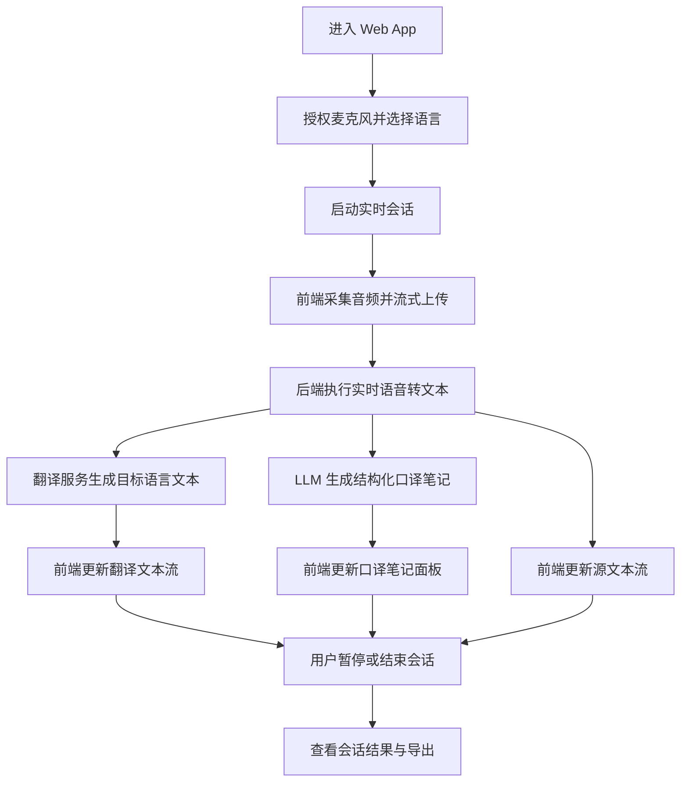

## 1. 产品概述
AI 智能同传助手是一款面向会议、演讲、课堂与跨语种沟通场景的实时同传工具，支持麦克风采集、实时转写、低延迟翻译与 AI 口译笔记生成。
- 解决用户在听译场景中“听不全、记不住、译不快”的问题，帮助译员、学习者与商务用户更高效地理解和输出信息。
- MVP 目标是优先打通网页端核心闭环，后续再扩展到移动端 App 与更专业的音频处理能力。

## 2. 核心功能

### 2.1 用户角色
| 角色 | 使用方式 | 核心权限 |
|------|----------|----------|
| 普通用户 | 进入 Web App 即可使用 | 麦克风授权、选择源/目标语言、查看转写/翻译/笔记结果 |

### 2.2 功能模块
1. **实时同传主页**：设备与语言配置、麦克风控制、三栏实时结果展示。
2. **会话结果页**：查看本次会话的完整转写、翻译与结构化笔记摘要。

### 2.3 页面详情
| 页面名称 | 模块名称 | 功能描述 |
|----------|----------|----------|
| 实时同传主页 | 顶部控制栏 | 选择输入设备、源语言、目标语言、开始/暂停/结束会话、切换深浅色模式 |
| 实时同传主页 | 源文本流面板 | 实时展示 STT 返回的源语言文本，支持按时间追加与状态标记 |
| 实时同传主页 | 翻译文本流面板 | 实时展示目标语言翻译内容，尽量与源文本片段对齐 |
| 实时同传主页 | 口译笔记面板 | 基于 LLM 输出结构化笔记，突出数字、术语、实体、逻辑关系与行动项 |
| 实时同传主页 | 音频状态区 | 展示麦克风权限、连接状态、当前音量级别、延迟与错误信息 |
| 会话结果页 | 会话摘要区 | 展示本场会话的标题、时长、语言配置、摘要卡片 |
| 会话结果页 | 导出区 | 预留导出文本、笔记、JSON 结构化结果的入口 |

## 3. 核心流程
用户进入系统后先授权麦克风并选择源语言和目标语言，随后启动实时会话。前端持续采集音频并通过流式链路发送给后端，后端完成 STT、翻译与笔记提炼后，将结果持续回推到前端三栏面板中。用户可随时暂停或结束会话，并在结束后查看完整结果。

## 4. 用户界面设计
### 4.1 设计风格
- 主色调：深色模式以石墨黑、蓝青高亮为主，浅色模式以米白、深蓝灰为主。
- 按钮风格：中等圆角、轻拟物阴影与清晰状态色，强调开始录音与停止操作的可辨识度。
- 字体与字号：中文优先使用思源黑体或苹方风格替代方案，英文采用具有科技感的无衬线字体；核心正文 14px 至 16px。
- 布局风格：桌面端优先，顶部控制栏加三列主工作区；移动端后续改为纵向堆叠。
- 图标风格：线性图标，状态信息通过颜色与小型徽标强化反馈。

### 4.2 页面设计概览
| 页面名称 | 模块名称 | UI 元素 |
|----------|----------|----------|
| 实时同传主页 | 顶部控制栏 | 设备选择器、语言下拉框、会话控制按钮、主题切换、连接状态标签 |
| 实时同传主页 | 源文本流面板 | 时间戳、流式文本块、识别状态标签、自动滚动容器 |
| 实时同传主页 | 翻译文本流面板 | 双语对齐卡片、翻译状态、低延迟片段追加动画 |
| 实时同传主页 | 口译笔记面板 | 分层提纲、关键词标签、数字高亮、术语卡片、逻辑箭头提示 |
| 实时同传主页 | 音频状态区 | 音量波形占位、权限提示、异常提示条 |
| 会话结果页 | 会话摘要区 | 统计卡片、会话信息头部、摘要段落、导出按钮 |

### 4.3 响应式
- 采用桌面优先设计，MVP 优先适配 1280px 以上宽屏场景。
- 兼容平板与窄屏笔记本，在 1024px 以下逐步压缩三栏宽度。
- 移动端先保证可浏览，不作为第一阶段主交互目标。

### 4.4 交互与反馈指导
- 麦克风授权前提供明确引导与失败重试入口。
- 会话进行中始终显示连接状态、处理进度与最近一次返回时间。
- 对实时文本采用渐进追加动画，但避免影响可读性。
- 对笔记区采用层级折叠与重点高亮，降低长时间听译下的信息疲劳。
