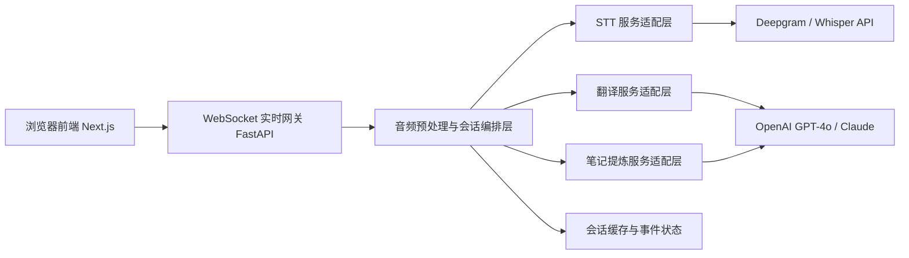
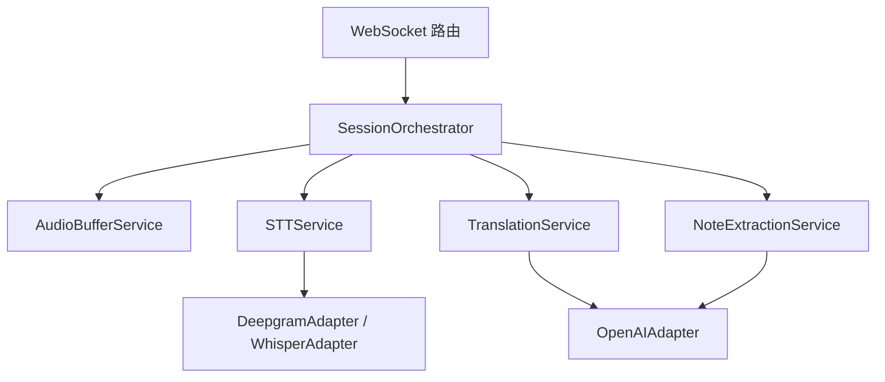
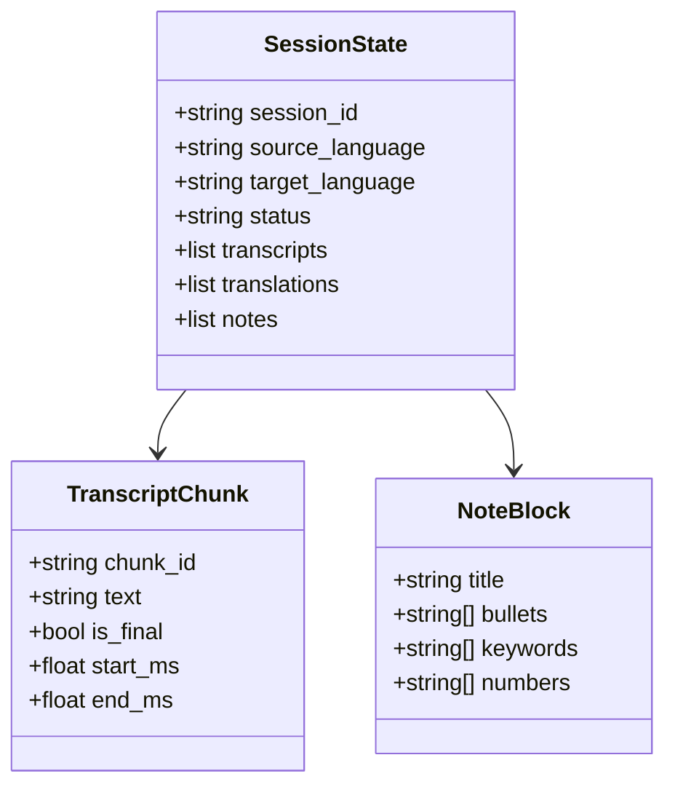

## 1. 架构设计


## 2. 技术说明
- 前端：Next.js 15 + React 19 + TypeScript + Tailwind CSS 4
- 前端状态管理：React hooks + Context，MVP 阶段避免引入额外全局状态库
- 前端实时能力：浏览器 `MediaDevices`、`MediaRecorder`、`Web Audio API`、原生 WebSocket
- 后端：FastAPI + Uvicorn + Python 3.11
- 后端实时能力：FastAPI WebSocket、异步任务编排、Pydantic 配置管理
- 音频处理：`numpy`、`soundfile`、`webrtcvad` 或轻量降噪组件作为后续扩展
- STT：优先预留 Deepgram 实时接口适配器，兼容 Whisper API 方案
- 翻译与笔记：OpenAI Responses / Chat Completions 兼容层，后续可扩展 Claude
- 数据存储：MVP 阶段先使用内存会话缓存；会话持久化、用户体系与数据库延后
- 初始化工具：前端使用 `create-next-app`，后端使用 `uv` 或 `pip` 初始化虚拟环境

## 3. 目录结构定义
| 路径 | 用途 |
|------|------|
| `frontend/` | Next.js Web App 主工程 |
| `frontend/src/app/` | App Router 页面与全局布局 |
| `frontend/src/components/` | UI 组件、面板、控制栏、状态组件 |
| `frontend/src/features/interpreter/` | 实时同传业务模块，包含采集、流式会话、展示逻辑 |
| `frontend/src/lib/` | WebSocket 客户端、音频工具、通用函数 |
| `frontend/src/types/` | 前后端共享的数据结构定义 |
| `backend/app/api/` | HTTP 与 WebSocket 接口层 |
| `backend/app/services/` | STT、翻译、笔记、会话编排服务 |
| `backend/app/adapters/` | 第三方 AI 服务适配器 |
| `backend/app/models/` | Pydantic 模型与数据结构 |
| `backend/app/core/` | 配置、日志、基础依赖 |
| `.env.example` | 环境变量模板 |
| `docker-compose.yml` | 后续本地联调与部署预留 |

## 4. 路由定义
| 路由 | 用途 |
|------|------|
| `/` | 实时同传主页，包含三栏面板与控制栏 |
| `/session/[id]` | 会话结果页，查看完整转写、翻译与笔记 |

## 5. API 定义
### 5.1 HTTP 接口
| 方法 | 路径 | 用途 |
|------|------|------|
| `GET` | `/api/health` | 健康检查 |
| `GET` | `/api/config` | 返回可用语言、模型、前端运行配置 |
| `POST` | `/api/session/start` | 初始化会话并返回会话 ID |
| `POST` | `/api/session/{session_id}/stop` | 结束当前会话 |

### 5.2 WebSocket 接口
| 路径 | 用途 |
|------|------|
| `/ws/session/{session_id}` | 音频分片上传、实时文本/翻译/笔记事件双向通信 |

### 5.3 事件模型
```ts
type ClientEvent =
  | {
      type: "audio_chunk";
      sessionId: string;
      sequence: number;
      mimeType: string;
      audioBase64: string;
      timestamp: number;
    }
  | {
      type: "control";
      sessionId: string;
      action: "pause" | "resume" | "stop";
    };

type ServerEvent =
  | {
      type: "transcript";
      sessionId: string;
      chunkId: string;
      text: string;
      isFinal: boolean;
      startMs?: number;
      endMs?: number;
    }
  | {
      type: "translation";
      sessionId: string;
      chunkId: string;
      text: string;
      targetLanguage: string;
    }
  | {
      type: "notes";
      sessionId: string;
      version: number;
      outline: Array<{
        title: string;
        bullets: string[];
        keywords: string[];
        numbers: string[];
      }>;
    }
  | {
      type: "status";
      sessionId: string;
      state: "idle" | "listening" | "processing" | "paused" | "stopped" | "error";
      message?: string;
    };
```

## 6. 服务端架构图


## 7. 数据模型
### 7.1 会话模型定义


### 7.2 配置与依赖清单
```text
前端核心依赖
- next
- react
- react-dom
- tailwindcss
- clsx
- lucide-react
- zustand（可选，若后续状态复杂度提升）

后端核心依赖
- fastapi
- uvicorn[standard]
- websockets
- pydantic
- pydantic-settings
- httpx
- python-dotenv
- openai
- numpy
- soundfile
- webrtcvad（可选）
```

## 8. 第一阶段实施策略
- 第一步：完成项目初始化、目录结构、依赖配置与环境变量模板。
- 第二步：实现桌面端三栏静态 UI、主题切换与麦克风权限获取。
- 第三步：完成前后端 WebSocket 联通，支持模拟文本流回传。
- 第四步：接入真实 STT、翻译与笔记提炼适配器，形成端到端链路。
